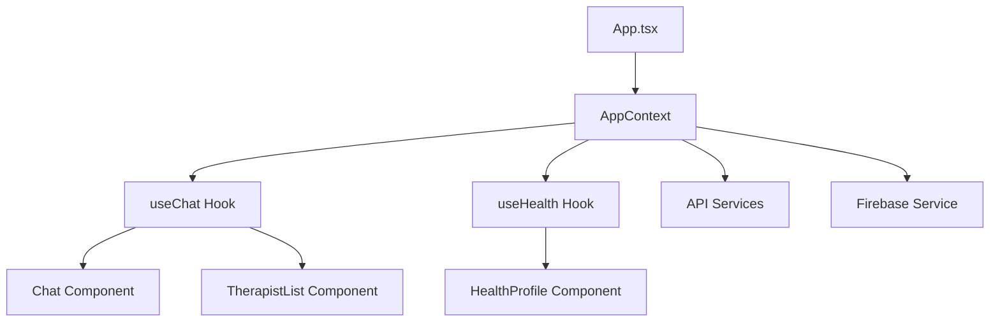

# 🌟 Completamente App - Arquitetura de Componentes

## 📋 Visão Geral

O Completamente App foi reestruturado para uma arquitetura moderna baseada em componentes React com TypeScript, proporcionando melhor manutenibilidade, escalabilidade e desenvolvimento orientado a tipos.

## 🏗️ Estrutura de Pastas

```
completamenteapp/
├── components/          # Componentes React reutilizáveis
│   ├── Chat.tsx        # Componente de chat terapêutico
│   ├── TherapistList.tsx # Lista de terapeutas disponíveis
│   └── HealthProfile.tsx # Perfil de saúde do usuário
├── contexts/           # Contextos React para gerenciamento de estado
│   └── AppContext.tsx  # Contexto principal da aplicação
├── hooks/              # Hooks personalizados
│   ├── useChat.ts      # Hook para gerenciamento de chat
│   └── useHealth.ts    # Hook para dados de saúde
├── services/           # Serviços de API e integrações
│   ├── api.ts          # Serviço de API (IA, nutrição, etc.)
│   └── firebase.ts     # Serviço de integração Firebase
├── utils/              # Utilitários e funções auxiliares
│   ├── dateUtils.ts    # Utilitários de data
│   └── healthUtils.ts  # Utilitários de cálculos de saúde
├── types/              # Definições de tipos TypeScript
│   └── index.ts        # Tipos principais da aplicação
├── css/                # Estilos CSS existentes
├── api/                # APIs existentes
├── js/                 # Scripts JavaScript legados
├── App.tsx             # Componente principal
├── main.tsx            # Ponto de entrada
├── index.css           # Estilos principais
└── index.html          # Template HTML
```

## 🔧 Tecnologias Utilizadas

### Core
- **React 18** - Biblioteca de UI
- **TypeScript 5.2** - Tipagem estática
- **Vite 5** - Build tool e dev server

### Estado & Dados
- **Context API** - Gerenciamento de estado global
- **Custom Hooks** - Lógica reutilizável
- **Firebase** - Banco de dados e autenticação

### Estilos
- **Tailwind CSS** - Utilitários de estilo
- **CSS Modules** - Estilos componentizados

## 🚀 Como Usar

### Instalação
```bash
npm install
```

### Desenvolvimento
```bash
npm run dev
```

### Build
```bash
npm run build
```

### Type Checking
```bash
npm run type-check
```

### Linting
```bash
npm run lint
npm run lint:fix
```

## 📱 Arquitetura de Componentes

### 1. AppContext
Gerencia o estado global da aplicação:
- Autenticação do usuário
- Dados principais do usuário
- Sincronização com Firebase
- Exportação/backup de dados

### 2. useChat Hook
Gerencia toda a lógica do chat:
- Lista de terapeutas
- Verificação de disponibilidade
- Envio/recebimento de mensagens
- Histórico de conversas

### 3. useHealth Hook
Gerencia dados de saúde:
- Cálculos de IMC e calorias
- Registro de água e exercícios
- Avaliações de ansiedade
- Metas e progresso

### 4. Componentes React

#### Chat Component
- Interface completa de chat
- Mensagens em tempo real
- Status de digitação
- Histórico de conversas

#### TherapistList Component
- Lista de terapeutas disponíveis
- Indicadores de status
- Informações de horário
- Sistema de disponibilidade

#### HealthProfile Component
- Formulário de medidas
- Cálculos automáticos
- Configuração de biotipo
- Perfil de atividade

## 🔄 Fluxo de Dados



## 🛠️ Serviços

### API Service
- Comunicação com APIs de IA
- Análise nutricional
- Geração de conteúdo
- Avaliação de ansiedade

### Firebase Service
- Sincronização de dados
- Armazenamento de chats
- Backup e recuperação
- Gerenciamento offline

## 📊 Tipos Principais

### User & UserData
```typescript
interface User {
  id: string;
  name: string;
  fullName: string;
  gender: 'M' | 'F';
  pass: string;
  createdAt: number;
}

interface UserData {
  pass: string;
  fullName: string;
  gender: 'M' | 'F';
  created: number;
  relacional: RelacionalData;
  saude: SaudeData;
  financas: FinancasData;
}
```

### Health Data
```typescript
interface SaudeData {
  weight?: number;
  height?: number;
  imc?: number;
  calorieNeed?: number;
  water?: WaterData;
  exercise?: ExerciseData;
  anxietyDaily?: AnxietyDaily;
  // ... outros campos
}
```

## 🎯 Benefícios da Nova Arquitetura

### 1. **Manutenibilidade**
- Código organizado por responsabilidade
- Componentes reutilizáveis
- Tipagem forte reduz bugs

### 2. **Escalabilidade**
- Fácil adicionar novos componentes
- Hooks reutilizáveis
- Serviços modulares

### 3. **Performance**
- Lazy loading de componentes
- Otimização de build
- Cache inteligente

### 4. **Desenvolvedor Experience**
- Autocompleção de código
- Refatoração segura
- Debugging melhorado

## 🔄 Migração do Código Legado

O código JavaScript existente em `js/app.js` está sendo gradualmente migrado:

### ✅ Já Migrado
- Sistema de chat
- Perfil de saúde
- Contexto principal
- Serviços de API

### 🔄 Em Progresso
- Sistema de finanças
- Jogos e relaxamento
- Relacional
- Rotinas

### 📋 Pendente
- Sistema de áudio
- Biblioteca
- Mural de inspirações

## 🚨 Considerações Importantes

### 1. **Compatibilidade**
- Mantido suporte ao código legado
- Migração gradual sem quebra
- Testes contínuos

### 2. **Performance**
- Componentes otimizados
- Lazy loading implementado
- Cache estratégico

### 3. **Segurança**
- Tipagem forte previne vulnerabilidades
- Validação de dados
- Sanitização de inputs

## 📱 Deploy

A aplicação está configurada para deploy na Vercel com GitHub Integration:

1. **Build automático** a cada push
2. **Preview deployments** para PRs
3. **Rollback automático** em caso de falha
4. **Analytics integrado**

## 🤝 Contribuição

### Para adicionar novos componentes:

1. Criar arquivo em `components/`
2. Definir tipos em `types/`
3. Implementar hook se necessário
4. Adicionar testes
5. Atualizar documentação

### Para modificar serviços:

1. Atualizar interface em `types/`
2. Modificar implementação em `services/`
3. Testar com hooks
4. Atualizar componentes

## 📚 Recursos Adicionais

- [Documentação React](https://react.dev/)
- [Documentação TypeScript](https://www.typescriptlang.org/)
- [Documentação Vite](https://vitejs.dev/)
- [Tailwind CSS](https://tailwindcss.com/)

---

## 🎉 Próximos Passos

1. **Completar migração** de todos os módulos
2. **Adicionar testes** unitários e integração
3. **Implementar CI/CD** completo
4. **Otimizar performance** e SEO
5. **Adicionar PWA** capabilities

---

*Esta arquitetura representa um avanço significativo na manutenibilidade e escalabilidade do Completamente App, preparando-o para o futuro do desenvolvimento web moderno.*
